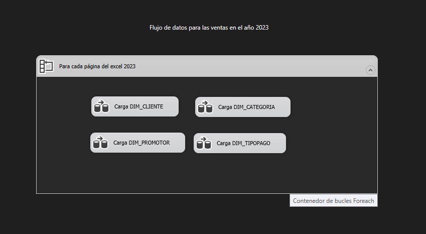
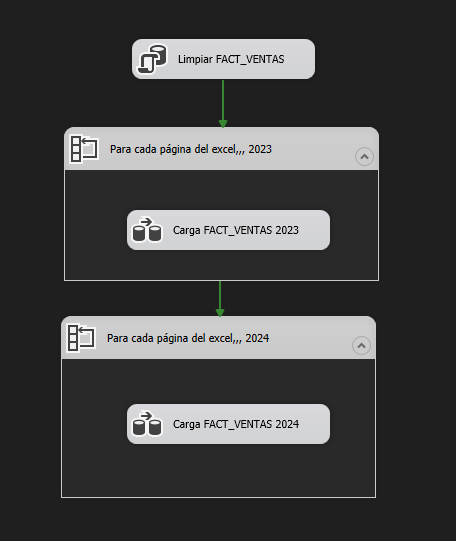
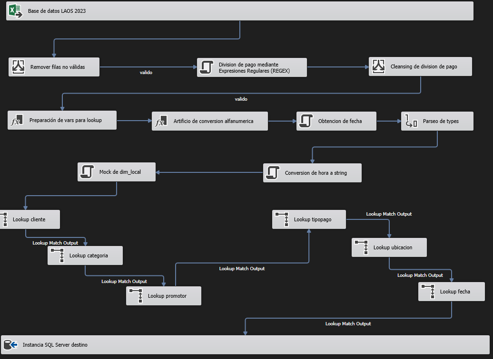

# proyecto-sie

Repositorio para el proyecto del curso de Sistemas de Inteligencia Empresarial del ciclo 2024-1 en la carrera de Ingeniería de Sistemas.

  

Grupo 4 - Integrantes:
- Jesu Amoretti
- Cesar Lujan
- Fabrizio Romero
- Gerson Oviedo
- Erick Valderrama
<!-- - Frank Tapia Aquino o7 -->

---

## Schema

## Schemas del proyecto-etl (SSIS)

### Carga de dimensiones

### Flujo de control de fact_ventas

### Flujo de datos de fact_ventas

## Quickstart
1. Crear una base de datos SQL Server con los siguientes parámetros: 
- User: sa
- Password: ul1m4@2024$1

2. Cargar el [script inicial](./seeders/initital_script.sql) para crear las dimensiones en la instancia SQL Server

3. Abrir la solución del [proyecto](./proyecto-etl/proyecto-etl.sln) con Visual Studio 2022 (SSIS)

---

4. Configurar las siguientes conexiones:

- LOCALHOST.STAGE_VENTAS.sa.conmgr: dirección de base de datos creada
- OLTP_VENTAS_2023.conmgr: [Excel de OLTP_VENTAS_2023](./static/cleansing_laos_ventas_2023.xlsx)
- OLTP_VENTAS_2024.conmgr: [Excel de OLTP_VENTAS_2024](./static/cleansing_laos_ventas_2024.xlsx)
- OLEDB_2023 y OLEDB_2024: Cambiar la dirección del "Servidor o Filename" por los excels OLTP correspondientes.

- Excel (paquete DIMS_TIEMPO)
  - DIM_FECHA: [Excel de DIM_FECHA](./seeders/dim_fecha.xlsx)
  - DIM_HORA: [Excel de DIM_HORA](./seeders/dim_hora.xlsx)

---

<!-- 5. Creacion de conexiones
- OLEDB para Excel
  - Clic derecho en bucle for each > Editar > Colección > Conexión > OLEDB_2023 o OLEDB_2024
  - Proveedores .NET de OLEDB > Microsoft Office 16.0 Access Database Engine...
    - Pegar la ruta del excel de [OLTP_VENTAS](./static/cleansing_laos_ventas_2024.xlsx) y aceptar
  - Verificar si la variable SheetName ha sido asignada con el valor "2"

- Conexiones con Excel
  - Poner ruta de excel -->

5. Ejecutar primero el paquete OLTP_VENTAS y luego CARGA_FACT.
